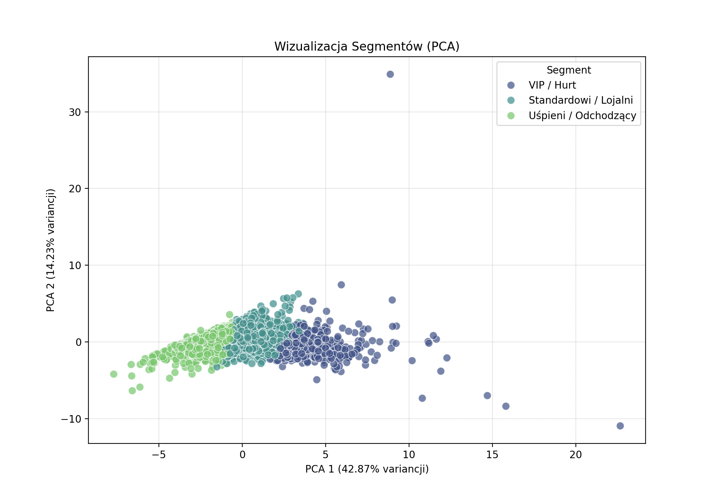
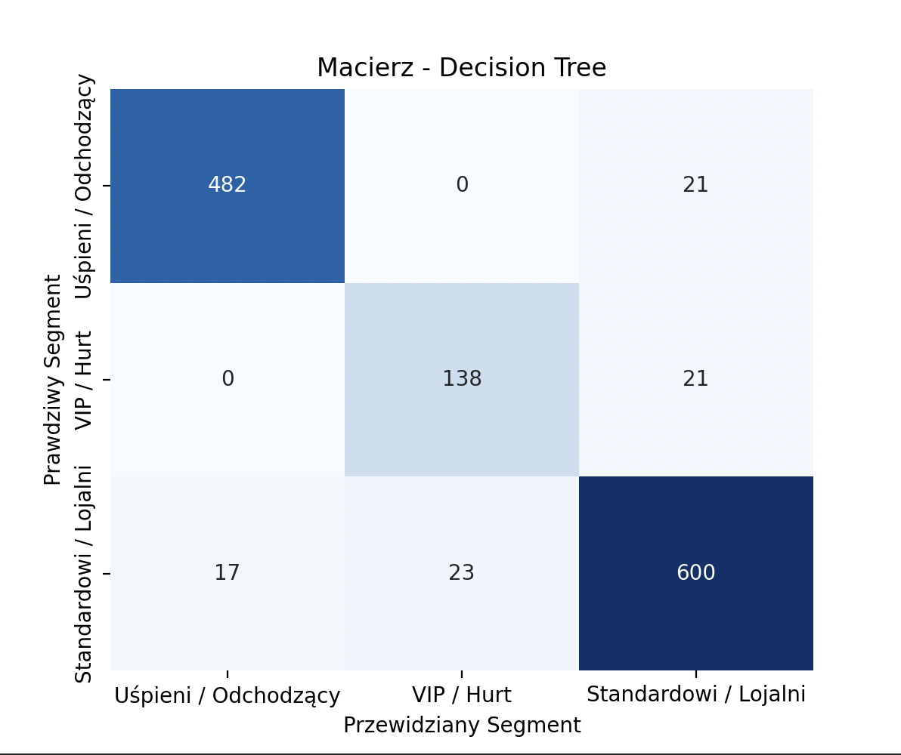
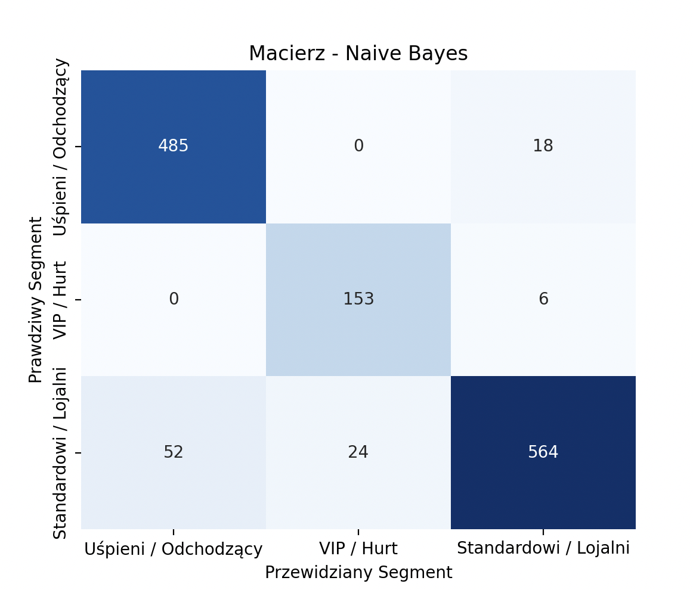

# MED – Metody Eksploracji Danych

## "Segmentacja klientów e-commerce na podstawie analizy zachowań zakupowych klientów"

#### Bartosz Zaborowski 319996

## 1. Opis projektu

Celem projektu jest budowa kompleksowego pipeline’u analitycznego do segmentacji klientów sklepu internetowego. W przeciwieństwie do podstawowych podejść, projekt uwzględnia wielowymiarową naturę zachowań konsumenckich, analizując nie tylko wartość zakupów, ale także częstotliwość zwrotów, regularność transakcji oraz preferencje czasowe.

W ramach projektu dokonano segmentacji klientów z użyciem algorytmu k-means (z uwzględnieniem transformacji logarytmicznej dla wartości odstających), a następnie przeprowadzono klasyfikację do wyznaczonych segmentów ("VIP", "Standardowi", "Uśpieni") za pomocą algorytmów:

* Drzewo decyzyjne (Decision Tree)
* Naiwny klasyfikator Bayesa (Naive Bayes)

## 2. Zbiór danych

W projekcie wykorzystano publiczny zbiór danych **Online Retail Dataset**, zawierający dane transakcyjne sklepu internetowego (źródło: Kaggle).

Każdy rekord w zbiorze reprezentuje pojedynczą pozycję na fakturze i zawiera m.in.:
* `InvoiceNo` - numer faktury (prefiks 'C' oznacza anulowanie/zwrot)
* `StockCode` - kod produktu
* `Description` - opis produktu
* `Quantity` - liczba zakupionych (lub zwróconych) sztuk
* `InvoiceDate` - data operacji
* `UnitPrice` - cena jednostkowa
* `CustomerID` - identyfikator klienta

Zbiór danych poddano czyszczeniu (usunięcie rekordów bez ID klienta), jednak zachowano informacje o zwrotach (ujemne wartości `Quantity`), które posłużyły do wygenerowania dodatkowych cech behawioralnych.

## 3. Opis algorytmów i metod

### 3.1 Rozbudowana Inżynieria Cech (Feature Engineering)

Zamiast ograniczać się do klasycznego RFM, w ramach rozwoju projektu, zgodnie z uwagami otrzymanymi od prowadzącego, zaimplementowano wielowymiarowy wektor cech, aby jak najlepiej oddać specyfikę klienta. Poniżej zestawienie analizowanych atrybutów wraz z ich nazwami zmiennych w kodzie:

**Analiza RFM (Podstawowa):**
* **Recency** (zmienna: `Recency`) - liczba dni od ostatniego zakupu klienta.
* **Frequency** (zmienna: `Frequency`) - liczba unikalnych transakcji (faktur).
* **Monetary** (zmienna: `Monetary`) - łączna suma wydatków klienta (po odjęciu zwrotów).

**Analiza Produktowa i Wolumenowa:**
* **Total Quantity** (zmienna: `TotalQuantity`) - całkowita liczba zakupionych sztuk produktów (fizyczna wielkość zamówień).
* **Unique Products** (zmienna: `UniqueProducts`) - różnorodność koszyka, mierzona liczbą unikalnych kodów produktów (`StockCode`).

**Analiza Wartości Koszyka:**
* **Average Ticket Value** (zmienna: `AvgTicketValue`) - średnia wartość pojedynczej transakcji.
* **Min Ticket Value** (zmienna: `MinTicketValue`) - wartość najmniejszego zamówienia.
* **Max Ticket Value** (zmienna: `MaxTicketValue`) - wartość największego zamówienia.

**Analiza Behawioralna i Czasowa:**
* **Average Days Between Purchases** (zmienna: `AvgDaysBetweenPurchases`) - średni odstęp czasu (w dniach) między kolejnymi zakupami.
* **Favorite Day** (zmienna: `FavoriteDay`) - dzień tygodnia, w którym klient najczęściej dokonuje zakupów (dominanta).

**Analiza Zwrotów:**
* **Return Count** (zmienna: `ReturnCount`) - liczba transakcji zwrotu (faktur z ujemną ilością).
* **Returned Unique Products** (zmienna: `ReturnedUniqueProducts`) - liczba unikalnych produktów, które klient zdecydował się zwrócić.

### 3.2 Obsługa wartości odstających (Logarytmizacja)

Ze względu na specyfikę danych e-commerce, zbiór charakteryzuje się rozkładem prawostronnie skośnym (right-skewed distribution). Oznacza to, że zdecydowana większość klientów dokonuje zakupów o niskiej wartości i częstotliwości, podczas gdy niewielka grupa klientów "hurtowych" osiąga wartości rzędu tysięcy lub milionów. Taka struktura danych stanowi problem dla algorytmu K-Means z dwóch powodów:

1. Pierwszym napotkanym problemem była wrażliwość na wartości odstające (Outliers). Zastosowany algorytm K-Means opiera się na odległości euklidesowej. Polega to na tym, że każdy klient jest traktowany jako punkt w wielowymiarowej przestrzeni, gdzie każda oś odpowiada jednej cesze. Algorytm przypisuje klienta do tego klastra (segmentu), którego centroid znajduje się w najmniejszej odległości euklidesowej od danego punktu. Oznacza to, że klienci o zbliżonych wartościach cech trafiają do tych samych segmentów, ponieważ geometrycznie leżą blisko siebie w przestrzeni cech. Klient, który wydał 1 000 000 zł, znajduje się geometrycznie tak daleko od reszty grupy (wydającej średnio 500 zł), że algorytm, próbując zminimalizować błąd, "poświęca" precyzję segmentacji mniejszych klientów, by dopasować centrum klastra do tego jednego odstającego przypadku. Jest to efekt niepożądany, który należało wyeliminować.

2. Kolejną kwestią była kwestia skali liniowej vs. relatywnej. Dla algorytmu różnica między wydatkiem 10 zł a 100 zł (różnica = 90) jest pod kątem matematycznym niemal identyczna jak różnica między 10 000 zł a 10 100 zł (różnica = 100). Patrząc jednal przez pryzmat biznesowy, pierwszy przypadek to 10-krotny wzrost wartości klienta, a drugi to pomijalna różnica (~1%). 

Aby wyeliminować te dwie problematyczne kwestie zaiplementowano przy wykorzystaniu biblioteki NumPy, transformację logarytmiczną funkcją `np.log1p` (czyli zwyczajnie ln(x+1)), dla cech: Monetary, Recency oraz TotalQuantity. Zastosowanie akurat ln(1 + x), zamiast klasycznej funkcji logarytmu wynika z faktu, że w danych występują wartości zerowe, na przykład dla cech takich jak Recency (klient dokonujący zakupu w bieżącym dniu) lub ReturnCount (brak zwrotów). Logarytm z zera jest niezdefiniowany i prowadzi do błędów numerycznych, natomiast funkcja `np.log1p` pozwala bezpiecznie przekształcić takie wartości, przypisując im wynik równy zero. Dzięki temu transformacja jest stabilna numerycznie i może być stosowana bez konieczności dodatkowego filtrowania danych.

Dzięki zastosowaniu takiego rozwiązania mogłem ograniczyć wpływ wartości skrajnych co przełożyło się pozytywnie na jakość mojej analizy. Logarytm naturalny powoduje kompresję skali danych. Bardzo duże wartości, potencjalnie zaburzające analizę, zostają „ściśnięte”, natomiast mniejsze pozostają względnie bardziej rozciągnięte. Dzięki temu ogromne różnice kwotowe występujące u klientów hurtowych zostają sprowadzone do skali porównywalnej z klientami detalicznymi, co zapobiega dominowaniu pojedynczych obserwacji. Dodatkową zaletą tej transformacji jest to, że rozkład danych staje się bliższy rozkładowi normalnemu, a jest to szczególnie istotne w przypadku algorytmów opartych na odległości i wariancji, takich jak wykorzystywany przeze mnie K-means, które są wrażliwe na skośne rozkłady oraz obecność wartości odstających.

### 3.3 Wykorzystywane algorytmy

* **k-means:** Użyty do wyznaczenia 3 naturalnych segmentów klientów na podstawie znormalizowanych cech.
* **Drzewo decyzyjne:** Model budujący reguły if-then, pozwalający na interpretację, które cechy (np. suma wydatków czy liczba zwrotów) decydują o przypisaniu do segmentu.
* **Naiwny klasyfikator Bayesa:** Model probabilistyczny, użyty jako punkt odniesienia.

## 4. Wybrane technologie

Projekt został zrealizowany w języku Python z wykorzystaniem bibliotek:
* **pandas / numpy** – przetwarzanie danych i inżynieria cech.
* **scikit-learn** – implementacja algorytmów ML, pipeline'ów transformacji oraz metryk oceny.
* **seaborn / matplotlib** – wizualizacja macierzy konfuzji, ważności cech oraz rzutowania PCA.

## 5. Opis implementacji

Projekt zachowuje modularną strukturę, gdzie każdy etap przetwarzania znajduje się w osobnym pliku.

### 5.1 Struktura projektu

Projekt posiada następującą strukturę katalogów:

```
MED/Projekt/
├── data/
│   └── OnlineRetail.csv
├── src/
│   ├── data_loader.py
│   ├── evaluation.py
│   ├── feature_engineering.py
│   ├── main.py
│   ├── preprocessing.py
│   ├── segmentation.py
│   ├── visualization.py
│   └── classifiers/
│       ├── decision_tree.py
│       └── naive_bayes.py
```

Taki podział umożliwia czytelne rozdzielenie odpowiedzialności pomiędzy poszczególne etapy przetwarzania danych oraz łatwą rozbudowę projektu w przyszłości.

### 5.2 Wczytywanie danych – `data_loader.py`

Moduł `data_loader.py` odpowiada za wczytanie danych transakcyjnych z pliku CSV. Zastosowano odpowiednie kodowanie znaków, zgodne ze specyfiką zbioru Online Retail.

```python
import pandas as pd

def load_data(path: str) -> pd.DataFrame:
    df = pd.read_csv(path, encoding="ISO-8859-1")
    return df
```

Moduł ten stanowi pierwszy krok pipeline’u i dostarcza dane wejściowe do dalszego przetwarzania.

### 5.3 Wstępne przetwarzanie – `preprocessing.py`

W przeciwieństwie do pierwotnej wersji, zwroty nie są już usuwane. Moduł usuwa jedynie braki danych (brak CustomerID) i oblicza kolumnę pomocniczą `TotalPrice`, zachowując ujemne wartości dla zwrotów, co jest kluczowe dla dalszej analizy.

```python
def preprocess(df: pd.DataFrame) -> pd.DataFrame:
    df = df.dropna(subset=["CustomerID"]).copy()
    df["InvoiceDate"] = pd.to_datetime(df["InvoiceDate"])
    df["TotalPrice"] = df["Quantity"] * df["UnitPrice"]
    return df
```

### 5.4 Inżynieria cech – analiza RFM (`feature_engineering.py`)

Moduł `feature_engineering.py` dzieli dane na strumień zakupów i zwrotów, a następnie agreguje je, w celu wyliczenia pełnego wektora cech opisanego w punkcie 3.1.

```python
import pandas as pd
import datetime as dt
import numpy as np

    # Data odniesienia, zakładam sobei dzień po ostatniej transakcji w zbiorze
def engineer_features(df: pd.DataFrame) -> pd.DataFrame:

    NOW = dt.datetime(2011, 12, 10)

    purchases = df[df["Quantity"] > 0].copy()
    returns = df[df["Quantity"] < 0].copy()

    invoice_stats = purchases.groupby(["CustomerID", "InvoiceNo"]).agg({
        "TotalPrice": "sum",
        "InvoiceDate": "min"
    }).reset_index()

    features = purchases.groupby("CustomerID").agg({
        "InvoiceDate": lambda x: (NOW - x.max()).days, # Recency
        "InvoiceNo": "nunique",                        # Frequency
        "StockCode": "nunique",                        # Liczba różnych produktów
        "Quantity": "sum",                             # Całkowita liczba kupionych sztuk
        "TotalPrice": "sum"                            # Monetary (Suma wydatków)
    })
    
    features.columns = ["Recency", "Frequency", "UniqueProducts", "TotalQuantity", "Monetary"]

    spending_stats = invoice_stats.groupby("CustomerID")["TotalPrice"].agg(
        ["mean", "min", "max"]
    )
    spending_stats.columns = ["AvgTicketValue", "MinTicketValue", "MaxTicketValue"]
    
    features = features.join(spending_stats)
    
    def calculate_avg_days_between(dates):
        if len(dates) < 2:
            return 0
        return dates.sort_values().diff().dt.days.mean()

    def get_favorite_day(dates):
        return dates.dt.dayofweek.mode()[0]

    time_stats = purchases.groupby("CustomerID")["InvoiceDate"].agg(
        [calculate_avg_days_between, get_favorite_day]
    )
    time_stats.columns = ["AvgDaysBetweenPurchases", "FavoriteDay"]
    time_stats["AvgDaysBetweenPurchases"] = time_stats["AvgDaysBetweenPurchases"].fillna(0)
    
    features = features.join(time_stats)
    
    return_stats = returns.groupby("CustomerID").agg({
        "InvoiceNo": "nunique",    # Liczba zwrotów
        "StockCode": "nunique"     # Liczba różnych zwróconych produktów
    })
    return_stats.columns = ["ReturnCount", "ReturnedUniqueProducts"]

    features = features.join(return_stats)

    features[["ReturnCount", "ReturnedUniqueProducts"]] = features[["ReturnCount", "ReturnedUniqueProducts"]].fillna(0)

    return features
```

### 5.5 Segmentacja klientów – `segmentation.py`

Implementacja uwzględniająca transformację logarytmiczną przed skalowaniem, co zabezpiecza model k-means przed "ściąganiem" klastrów przez klientów o ekstremalnie wysokich obrotach.

```python
import pandas as pd
import numpy as np
from sklearn.preprocessing import StandardScaler
from sklearn.cluster import KMeans

def segment_customers(df: pd.DataFrame, n_clusters: int = 3) -> tuple[pd.DataFrame, np.ndarray]:
    
    # Kopia, aby nie modyfikować oryginału w funkcji
    data = df.copy()

    features_col = data.select_dtypes(include=[np.number]).columns.tolist()
    
    X = data[features_col].copy()

    skewed_features = [
        "Recency", "Frequency", "Monetary", 
        "TotalQuantity", "AvgTicketValue", "AvgDaysBetweenPurchases",
        "MaxTicketValue", "ReturnCount"
    ]
    
    for col in skewed_features:
        if col in X.columns:
            min_val = X[col].min()
            if min_val < 0:
                X[col] = X[col] - min_val  # przesunięcie, by min było 0
            X[col] = np.log1p(X[col])

    scaler = StandardScaler()
    X_scaled = scaler.fit_transform(X)

    kmeans = KMeans(n_clusters=n_clusters, random_state=42, n_init=10)
    kmeans.fit(X_scaled)

    df["Segment"] = kmeans.labels_

    return df, X_scaled
```

### 5.6 Klasyfikatory – `decision_tree.py` i `naive_bayes.py`

W projekcie zastosowano dwa klasyczne algorytmy uczenia nadzorowanego: drzewo decyzyjne oraz naiwny klasyfikator Bayesa. Oba modele zostały zaimplementowane w postaci osobnych klas, co zapewnia czytelność kodu, spójny interfejs oraz możliwość łatwej rozbudowy lub wymiany algorytmów w przyszłości.

Po rozwinięciu projektu klasyfikatory nie ograniczają się już tylko do podstawowych cech RFM. Modele trenowane są na pełnym, 12-wymiarowym wektorze cech, obejmującym również statystyki zwrotów, średnie wartości koszyka oraz wskaźniki czasowe (opisane w sekcji 3.1). Dane wejściowe poddawane są wcześniej logarytmizacji i standaryzacji, aby zapewnić optymalne warunki pracy dla algorytmów wrażliwych na skalę.

Zmienną docelową są etykiety segmentów ("VIP", "Standardowi", "Uśpieni") wygenerowane wcześniej przez algorytm k-means. W ten sposób problem klasyfikacji polega na nauczeniu modeli "rozumienia" logiki segmentacji i przypisywania nowych klientów do grup na podstawie ich złożonego profilu behawioralnego.

**Charakterystyka modeli:**

* **Drzewo decyzyjne** - Wykorzystuje mechanizm hierarchicznych reguł decyzyjnych. W zaktualizowanej wersji projektu model ten pełni kluczową rolę w interpretacji wyników, bo dzięki analizie ważności cech (Feature Importance) pozwala wskazać, które z nowych atrybutów (np. `TotalQuantity` czy `ReturnCount`) są decydujące dla przypisania klienta do segmentu VIP.

* **Naiwny klasyfikator Bayesa** - Opiera się na probabilistycznym podejściu i założeniu niezależności cech. W implementacji wykorzystano wariant Gaussa. Choć założenie o niezależności cech w e-commerce jest uproszczeniem (np. `Monetary` jest skorelowane z `Quantity`), to dzięki wcześniejszej transformacji logarytmicznej, która zbliżyła rozkłady cech do normalnych, model ten osiąga bardzo wysoką skuteczność i stanowi solidny punkt odniesienia.

Oba klasyfikatory udostępniają jednolity interfejs (`train`, `predict`), co umożliwia ich bezpośrednie porównanie na tym samym zbiorze testowym.

### 5.7 Ewaluacja modeli – `evaluation.py`

Moduł `evaluation.py` odpowiada za ocenę jakości klasyfikacji. 

```python
from sklearn.metrics import classification_report, accuracy_score, confusion_matrix

def evaluate_model(y_true, y_pred, model_name="Model"):

    print(f"\n--- Ocena modelu: {model_name} ---")
    
    acc = accuracy_score(y_true, y_pred)
    print(f"Accuracy: {acc:.4f}")
    
    print("\nClassification Report:")
    print(classification_report(y_true, y_pred))
    
    print("Confusion Matrix (text):")
    print(confusion_matrix(y_true, y_pred))
```

Dodatkowo powstał nowy plik `visualization.py` odpowiedzialny za generowanie wizualizacji, pozwalające lepiej zobrazować wyniki oraz pokazać zasadę działania samych algorytmów. Wizualizacje zostały rozszerzone o wykres PCA (rzutowanie wielowymiarowe na 2D) oraz Feature Importance dla drzewa decyzyjnego, aby zbadać wpływ nowych cech na model.


### 5.8 Plik główny – `main.py`

Plik `main.py` integruje wszystkie opisane wcześniej moduły, steruje przepływem danych i realizuje pełny przebieg eksperymentu. Jego struktura została rozbudowana o etapy analizy i wizualizacji:

```python
# 1. Wczytanie danych
# 2. Preprocessing
# 3. Rozbudowana inżynieria cech
# 4. Segmentacja
# 5. Podział na zbiór treningowy i testowy (Train-test split)
# 6. Klasyfikacja
# 7. Ewaluacja i Wizualizacja
```
Plik ten pełni również rolę orkiestratora, który mapuje numeryczne identyfikatory segmentów na biznesowe nazwy ("VIP", "Standardowi", "Uśpieni") przed wygenerowaniem końcowych raportów.

## 6. Opis wyników

Po rozszerzeniu zbioru cech o atrybuty behawioralne i statystyki zwrotów, uzyskano bardzo wysoką jakość segmentacji oraz stabilne modele klasyfikacyjne. W wyniku klasteryzacji zidentyfikowano 3 wyraźne grupy klientów:

- **VIP / Hurt (Segment 1)** – Klienci o bardzo wysokim Monetary (średnio >10k j.p.) i dużej częstotliwości zakupów. Jest to grupa najmniej liczna (support: 159), ale najbardziej dochodowa.

- **Standardowi / Lojalni (Segment 2)** – Klienci regularni (zakupy co ok. 2 miesiące), o średniej wartości koszyka. Najliczniejsza grupa (support: 640).

- **Uśpieni / Odchodzący (Segment 0)** – Klienci, którzy kupowali dawno (średnio 152 dni temu), charakteryzujący się niską aktywnością i wartością zakupów.

### 6.1 Analiza wizualna segmentacji (K-Means i PCA)

W celu weryfikacji jakości podziału dokonanego przez algorytm k-means, zrzutowano wielowymiarową przestrzeń cech na przestrzeń dwuwymiarową za pomocą analizy głównych składowych (PCA).



Osie wykresu, oznaczone jako PCA1 (oś pozioma) i PCA2 (oś pionowa), wyjaśniają odpowiednio 42.87% oraz 14.23% wariancji. Oznacza to, że rzut ten zachowuje ponad 57% kluczowych informacji o różnicach między klientami, redukując 12-wymiarową przestrzeń cech do czytelnego obrazu 2D.

Jak możemy zauważyć na wykresie utworzone klastry są wyraźnie odseparowane, co świadczy o tym, że dobrane cechy (w tym logarytmizowane wartości finansowe) skutecznie różnicują klientów. Spójność jest zachowana, punkty wewnątrz segmentów (szczególnie "Uśpieni" i "Standardowi") tworzą zwarte skupiska. Widzimy, że segment VIP jest najbardziej rozproszony, co wynika z faktu, że w tej grupie zakresy kwotowe są ogromne (od kilkunastu tysięcy do milionów), podczas gdy segmenty detaliczne są bardziej jednorodne.

### 6.2 Wyniki klasyfikacji - Drzewo Decyzyjne

Drzewo decyzyjne okazało się najskuteczniejszym modelem, osiągając dokładność na poziomie 93.7%.

```
--- Decision Tree ---

--- Ocena modelu: Decision Tree ---
Accuracy: 0.9370

Classification Report:
              precision    recall  f1-score   support

           0       0.97      0.96      0.96       503
           1       0.86      0.87      0.86       159
           2       0.93      0.94      0.94       640

    accuracy                           0.94      1302
   macro avg       0.92      0.92      0.92      1302
weighted avg       0.94      0.94      0.94      1302
```

Model osiaga wysoka precyzję dla skrajnych grup. Bardzo dobrze identyfikuje klientów "Uśpionych" (Precision: 0.97, Recall: 0.96). Oznacza to, że reguły oparte na Recency są bardzo silne.

Dla Segmentu VIP osiągnięto F1-score na poziomie 0.86. Jest to wynik bardzo dobry, biorąc pod uwagę niewielką liczebność tej klasy (zaledwie ~12% zbioru testowego). Błędy wynikają prawdopodobnie głównie z granicznych przypadków między "bardzo dobrym klientem standardowym" a "małym klientem VIP".

Poniżej przedstawiono wygenerowaną macierz konfuzji:


Analiza macierzy konfuzji wskazuje na wysoką stabilność modelu, co potwierdzają dominujące wartości na przekątnej (482, 138, 600), oznaczające poprawne predykcje. Szczególnie istotny biznesowo jest fakt, że żaden klient z segmentu VIP (wiersz środkowy) nie został błędnie zaklasyfikowany jako 'Uśpiony' (zero w pierwszej kolumnie), co minimalizuje ryzyko zaniedbania kluczowych nabywców. Główne błędy koncentrują się na granicy między segmentami VIP a Standardowymi (łącznie 44 pomyłki w obu kierunkach), co jest zrozumiałe ze względu na płynną granicę między 'bardzo dobrym klientem standardowym' a 'początkującym VIP-em'.

Dodatkowo analiza struktury drzewa pozwala zrozumieć, jakie czynniki decydują o przypisaniu do segmentu dlatego wygenerowany został wykres ważności cech (Feature Importance).


Z wykresu wynika, że kluczowymi atrybutami decyzyjnymi nie jest tylko suma wydatków (Monetary), ale również całkowita liczba zakupionych produktów (TotalQuantity) oraz częstotliwość zakupów (Frequency / AvgDaysBetweenPurchases). Potwierdza to zasadność rozszerzenia inżynierii cech bo model korzysta teraz z wielowymiarowego obrazu klienta, a nie tylko z prostej wartości sprzedaży.

### 6.3 Wyniki klasyfikacji - Naiwny Klasyfikator Bayesa

Model Naive Bayes osiągnął nieznacznie niższy, lecz wciąż bardzo wysoki wynik dokładności: 92.3%.

```
--- Naive Bayes ---

--- Ocena modelu: Naive Bayes ---
Accuracy: 0.9232

Classification Report:
              precision    recall  f1-score   support

           0       0.90      0.96      0.93       503
           1       0.86      0.96      0.91       159
           2       0.96      0.88      0.92       640

    accuracy                           0.92      1302
   macro avg       0.91      0.94      0.92      1302
weighted avg       0.93      0.92      0.92      1302
```

Jak możemy zauważyć Bayes charakteryzuje się bardzo wysoką czułością (Recall: 0.96) dla segmentu VIP. Wykrył on 96% wszystkich najważniejszych klientów, co w zastosowaniach marketingowych może być ważniejsze niż precyzja (lepiej omyłkowo dać rabat klientowi standardowemu, niż pominąć VIP-a). Nieznacznie gorszy ogólny wynik względem drzewa wynika prawdopodobnie z założenia niezależności cech w algorytmie Bayesa (podczas gdy w e-commerce cechy takie jak Monetary i Quantity są silnie skorelowane). Mimo to, wynik powyżej 92% dowodzi, że po zastosowaniu transformacji logarytmicznej, rozkłady cech są wystarczająco zbliżone do normalnych, by działał efektywnie.

Poniżej przedstawiono macierz konfuzji:


Macierz dla modelu Naive Bayes ujawnia bardzo dużą czułość w wykrywaniu segmentu VIP (środkowy wiersz), gdzie model poprawnie zidentyfikował aż 153 z 159, myląc ich jedynie z klientami Standardowymi. W przeciwieństwie do drzewa decyzyjnego, algorytm ten częściej popełnia błędy przy klasyfikacji klientów Standardowych jako Uśpionych (52 przypadki w dolnym lewym rogu), co może wynikać z probabilistycznej natury modelu przy mniej wyraźnych granicach między tymi grupami. Mimo to, zerowa wartość w komórce [1,0] potwierdza, że model jest bezpieczny biznesowo, ponieważ żaden kluczowy klient VIP nie został błędnie oznaczony jako nieaktywny.

## 7. Wnioski

Zrealizowany projekt potwierdził, że zaawansowana inżynieria cech jest kluczowa dla skutecznej segmentacji klientów e-commerce. Przeprowadzone eksperymenty prowadzą do następujących wniosków:

1. **Kluczowa rola Inżynierii Cech (Feature Engineering):**
Przejście z podstawowego modelu RFM (3 cechy) na rozszerzony wektor atrybutów okazało się decydujące dla jakości analizy. Uwzględnienie statystyk zwrotów oraz odstępów czasowych między zakupami pozwoliło na wyodrębnienie bardziej realistycznych profili klientów. Wykres ważności cech (Feature Importance) potwierdził, że atrybuty takie jak `TotalQuantity` czy `AvgDaysBetweenPurchases` mają kluczowy wpływ na decyzje modelu.

2. **Skuteczna obsługa wartości odstających:**
Zastosowanie transformacji logarytmicznej (`np.log1p`) zamiast sztywnej dyskretyzacji okazało się optymalnym rozwiązaniem dla danych e-commerce o rozkładzie skośnym. Pozwoliło to na "spłaszczenie" wpływu klientów hurtowych na algorytm k-means, zachowując jednocześnie ciągłość i precyzję danych liczbowych. Dzięki temu uniknięto sztucznego szatkowania danych na przedziały.

3. **Wysoka jakość segmentacji:**
Zidentyfikowane grupy klientów (VIP, Standardowi, Uśpieni) są spójne biznesowo i wyraźnie odseparowane w przestrzeni wielowymiarowej (co potwierdza wizualizacja PCA). Każdy segment wymaga innej strategii marketingowej, co czyni ten model użytecznym narzędziem biznesowym.

4. **Przewaga Drzewa Decyzyjnego:**
Model Drzewa Decyzyjnego osiągnął najwyższą skuteczność (Accuracy: 93.7%). Jego niewielka przewaga nad Naiwnym Klasyfikatorem Bayesa (Accuracy: 92.3%) wynika z faktu, że drzewo lepiej radzi sobie ze skorelowanymi cechami (np. `Monetary` jest zależne od `Quantity`) oraz potrafi tworzyć nieliniowe reguły decyzyjne, które idealnie odwzorowują granice między segmentami.

Podsumowując, połączenie nienadzorowanej segmentacji (k-means) z nadzorowaną klasyfikacją pozwala nie tylko odkryć strukturę bazy klienckiej, ale także zbudować automat, który z 94-procentową skutecznością potrafi przypisać nowego klienta do właściwej grupy na podstawie jego historii transakcji.
