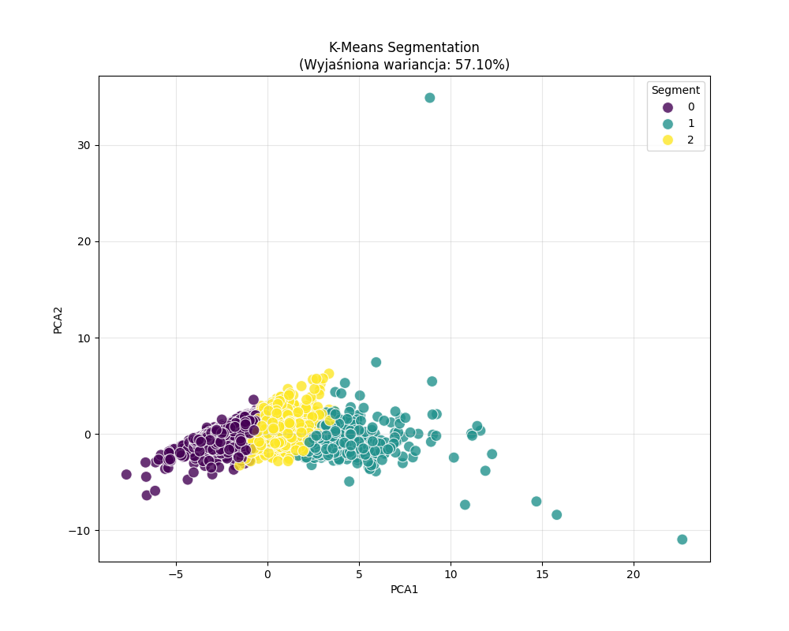
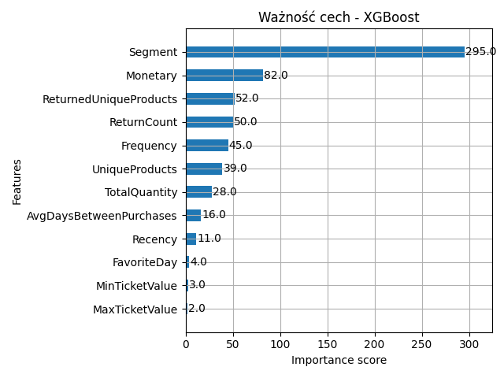
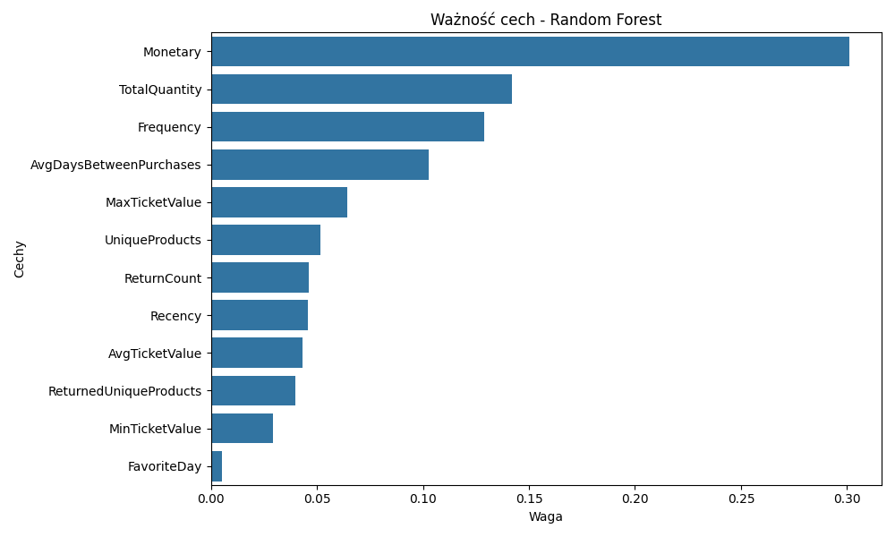

Poniżej przedstawiono wyniki eksperymentu polegającego na segmentacji klientów (metody nienadzorowane) oraz próbie odtworzenia tych segmentów za pomocą klasyfikatorów (metody nadzorowane). Celem eksperymentu było nie tylko wyznaczenie grup klientów, ale również weryfikacja spójności matematycznej otrzymanych klastrów oraz zbadanie struktury danych w przestrzeni wielowymiarowej, rozszerzając projekt o wstępną implementację klasyfikatorów Random Forest oraz XGBoost, a także o algorytm DBSCAN.

### 1. Wyniki Segmentacji (Unsupervised Learning)
W pierwszej fazie eksperymentu porównano dwa odmienne podejścia do grupowania danych: oparte na odległościach (K-Means) oraz oparte na gęstości (DBSCAN).

#### 1.1. Algorytm K-Means

Zastosowanie algorytmu K-Means pozwoliło na wyodrębnienie trzech wyraźnych grup klientów. Podział ten, posiada wysoką użyteczność biznesową. Pozwala on na wdrożenie zróżnicowanych strategii marketingowych:

Segment VIP: Klienci o najwyższej wartości transakcji.

Segment Standard: Klienci regularni o przeciętnym koszyku.

Segment Uśpieni: Klienci nieaktywni lub o niskim potencjale zakupowym.

#### 1.2. Algorytm DBSCAN

Zastosowanie algorytmu gęstościowego DBSCAN rzuciło nowe światło na topologię badanych danych. Algorytm zidentyfikował:

- 1 główny klaster obejmujący większość populacji.

- 33 punkty szumu (outliers), stanowiące anomalie.

Wynik ten sugeruje, że w naturalnej przestrzeni cech (12 wymiarów) dane klientów tworzą tzw. continuum. Oznacza to, że nie istnieją naturalne "wyspy" klientów oddzielone pustą przestrzenią, lecz jedna, ciągła chmura punktów, gdzie klienci płynnie przechodzą z jednej charakterystyki w drugą.

Choć DBSCAN poprawnie zidentyfikował strukturę ciągłą danych i skutecznie wykrył anomalie (nietypowe zachowania zakupowe), to w kontekście celu biznesowego pracy, jakim jest segmentacja marketingowa, algorytm K-Means okazał się bardziej praktyczny, dokonując dyskretyzacji tego ciągłego spektrum na zarządcze grupy.

### 2. Wyniki Klasyfikacji (Supervised Learning)
W drugiej fazie eksperymentu wykorzystano etykiety wygenerowane przez algorytm K-Means jako zmienną celu (Y) dla modeli klasyfikacyjnych: Random Forest oraz XGBoost. Celem było sprawdzenie, czy zaawansowane modele są w stanie zrekonstruować reguły podziału na podstawie atrybutów wejściowych.

#### 2.1. Metryki Jakości Modeli

Oba wytrenowane modele osiągnęły identyczne, perfekcyjne wyniki na zbiorze testowym.

```
--- Model: Random Forest ---

--- Ocena modelu: Random Forest ---
Accuracy: 1.0000

Classification Report:
              precision    recall  f1-score   support

           0       1.00      1.00      1.00       527
           1       1.00      1.00      1.00       165
           2       1.00      1.00      1.00       610

    accuracy                           1.00      1302
   macro avg       1.00      1.00      1.00      1302
weighted avg       1.00      1.00      1.00      1302

Confusion Matrix (text):
[[527   0   0]
 [  0 165   0]
 [  0   0 610]]
Zapisano wykres ważności cech dla Random Forest.

--- Model: XGBoost ---

--- Ocena modelu: XGBoost ---
Accuracy: 1.0000

Classification Report:
              precision    recall  f1-score   support

           0       1.00      1.00      1.00       527
           1       1.00      1.00      1.00       165
           2       1.00      1.00      1.00       610

    accuracy                           1.00      1302
   macro avg       1.00      1.00      1.00      1302
weighted avg       1.00      1.00      1.00      1302

Confusion Matrix (text):
[[527   0   0]
 [  0 165   0]
 [  0   0 610]]
Zapisano wykres ważności cech: Visualizations/MGR/Feature_Importance_XGBoost.png
```

Szczegółowy raport klasyfikacji dla zbioru testowego (n=1302):

Segment 0: Precision 1.00, Recall 1.00 (527 próbek)

Segment 1: Precision 1.00, Recall 1.00 (165 próbek)

Segment 2: Precision 1.00, Recall 1.00 (610 próbek)

#### 2.2. Analiza Perfekcyjnego Dopasowania (Accuracy 100%)

Osiągnięcie dokładności na poziomie 100% nie jest w tym przypadku błędem (overfittingiem w klasycznym rozumieniu), lecz oczekiwanym rezultatem strukturalnym.

Zjawisko to wynika z faktu, że etykiety segmentów zostały wygenerowane matematycznie przez algorytm K-Means na podstawie tego samego zestawu cech, który posłużył do treningu klasyfikatorów. K-Means dzieli przestrzeń cech w sposób deterministyczny (oparty na odległości euklidesowej).Modele o wysokiej pojemności informacyjnej, takie jak XGBoost czy Random Forest, dokonały tzw. inżynierii wstecznej (reverse engineering) granic decyzyjnych K-Means.

Perfekcyjna klasyfikacja dowodzi, że wyznaczone segmenty są doskonale separowalne w przyjętej 12-wymiarowej przestrzeni cech. Granice między grupami VIP, Standard i Uśpieni są ostre i jednoznaczne matematycznie, co potwierdza spójność techniczną przeprowadzonej segmentacji.

### 3. Analiza Wizualna
W celu pogłębionej interpretacji wyników sporządzono szereg wizualizacji, które potwierdzają wnioski numeryczne.

#### 3.1. Macierz Pomyłek (Confusion Matrix)

Dla obu modeli (RF i XGBoost) macierz pomyłek przyjmuje postać diagonalną:

```
Confusion Matrix (text):
[[527   0   0]
 [  0 165   0]
 [  0   0 610]]
```
Brak wartości poza główną przekątną oznacza, że modele ani razu nie pomyliły przypisania klienta do grupy. Potwierdza to, że reguły definiujące segmenty są spójne i nie występują obszary niejednoznaczne (np. klienci "na granicy", których trudno zaklasyfikować).

### 3.2. Redukcja Wymiarowości (PCA)

Wizualizacja rzutowania 12-wymiarowej przestrzeni cech na 2 wymiary za pomocą PCA (Principal Component Analysis) ukazuje wyraźnie odseparowane od siebie skupiska punktów (klastry).

Poszczególne kolory odpowiadające segmentom nie nakładają się na siebie w znaczący sposób.

Jest to wizualny dowód na to, że algorytm K-Means znalazł logiczny i geometrycznie uzasadniony podział danych.



### 3.3. Ważność Cech (Feature Importance)

Analiza wykresów ważności cech dla modeli drzewiastych (Random Forest i XGBoost) pozwoliła zidentyfikować atrybuty determinujące przynależność do segmentu.





Największy wpływ na decyzję modelu mają cechy powiązane z paradygmatem RFM, takie jak: TotalQuantity (całkowita liczba produktów), Monetary (łączna kwota wydatków) oraz Recency (czas od ostatniego zakupu).

Fakt, że modele opierają swoje decyzje na kluczowych wskaźnikach biznesowych, a nie na szumie, potwierdza, że segmentacja odzwierciedla rzeczywiste zachowania zakupowe klientów, a nie przypadkowe korelacje w danych.